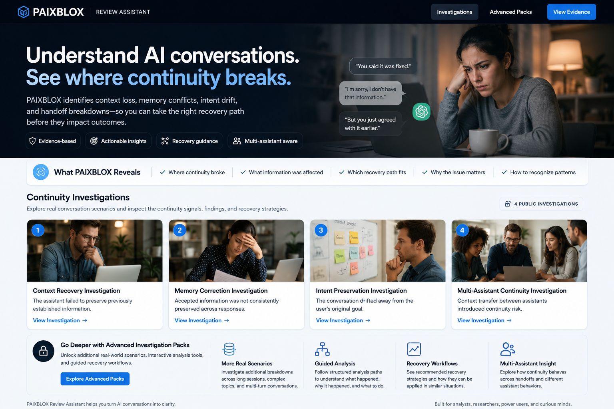

# PAIXBLOX

PAIXBLOX explores AI conversation continuity failures, context drift, recovery paths, and structured investigation records.

## Hugging Face Dataset

Sample JSONL continuity investigation records:

https://huggingface.co/datasets/paixblox/paixblox-context-drift-investigation

## Interactive Space

Explore the records as an interactive investigation:

https://huggingface.co/spaces/paixblox/PAIXBLOX-Continuity-Investigations

## What This Shows

- Context drift investigation records
- Continuity failure examples
- Recovery guidance
- Evidence-style review
- Human-readable and machine-readable JSONL samples

## Use

Open the Hugging Face Space to explore the investigation visually, or inspect the JSONL dataset directly for structured continuity records.
